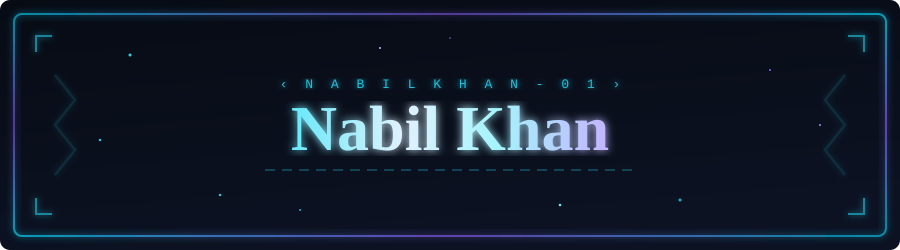
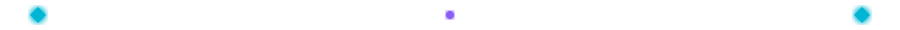
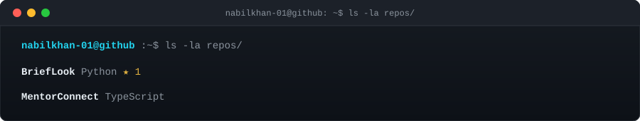
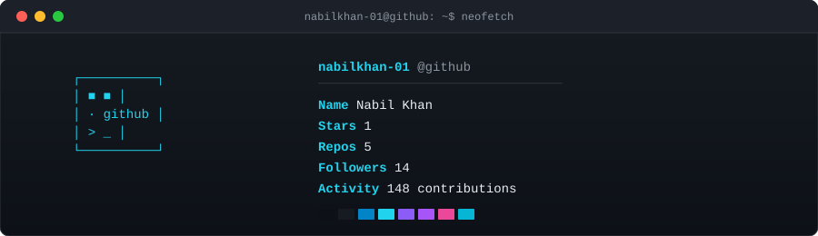

<div align="center">
  
</div>

---

## ⚡ whoami

```typescript
const nabilkhan_01 = {
  name: "Nabil Khan",
  role: "Computer Science Student",
  openTo: "Interesting Projects & Collaborations",
};
```

<p align="center">
  
</p>

## 🌌 Featured Projects

<p align="center">
  
</p>

→ [**MentorConnect**](https://github.com/nabilkhan-01/MentorConnect) · Centralized mentor–mentee management system<br/>
→ [**BriefLook**](https://github.com/nabilkhan-01/BriefLook) · Quick-glance information tool

<p align="center">
  
</p>

## 📊 GitHub Stats

<p align="center">
  
</p>

<p align="center">
  
</p>

## 🐾 Contribution Activity

<p align="center">
  
</p>

<p align="center">
  
</p>

## 🌐 Connect

**LinkedIn** → [nabil-khan01](https://www.linkedin.com/in/nabil-khan01/)<br/>
**Website** → [nabilkhan.tech](https://nabilkhan.tech)<br/>
**Email** → [nabilkhan1708@gmail.com](mailto:nabilkhan1708@gmail.com)

---

<div align="center">

`keep building · keep learning · keep improving`

</div>