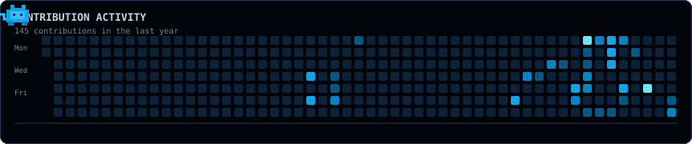

<div align="center">

# Nabil Khan

### building systems, one idea at a time.

Computer Science student interested in building practical software
and understanding how the systems behind it work.

</div>

---

## TOOLBOX

```text
$ nabil --toolbox

LANGUAGES
  Java · TypeScript · JavaScript

FRONTEND
  React · Vite

BACKEND
  Node.js · Express

DATABASE
  PostgreSQL

TOOLS
  Git · GitHub · VS Code
```

---

## PROJECT

```text
01  MentorConnect

    Centralized mentor–mentee management system

    ├─ mentor–mentee relationship management
    ├─ mentor–mentee group communication
    ├─ admin–mentor group communication
    ├─ meeting tracking
    ├─ structured feedback
    └─ role-based access

    status    : completed
    demo      : ready
    data      : system-generated / no real student or faculty data
```
→ [View repository](https://github.com/nabilkhan-01/MentorConnect)
---

## CONTRIBUTION ACTIVITY

<p align="center">
  
</p>

---

## CONNECT

```text
$ nabil --connect

LinkedIn   →  https://www.linkedin.com/in/nabil-khan01/
Website    →  https://nabilkhan.tech
Email      →  nabilkhan1708@gmail.com
```
---

<div align="center">

`keep building · keep learning · keep improving`

</div>